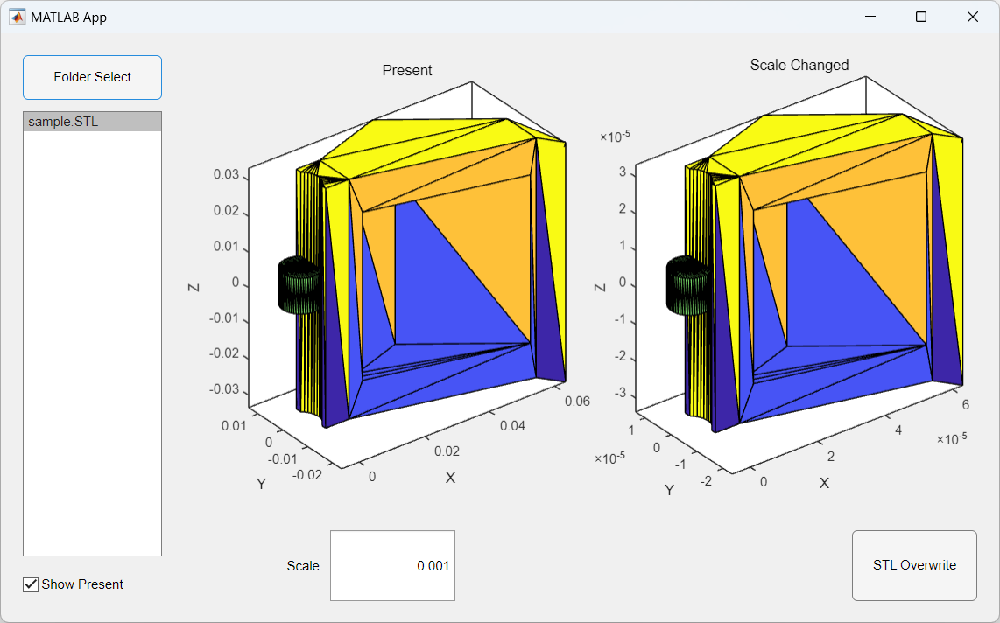
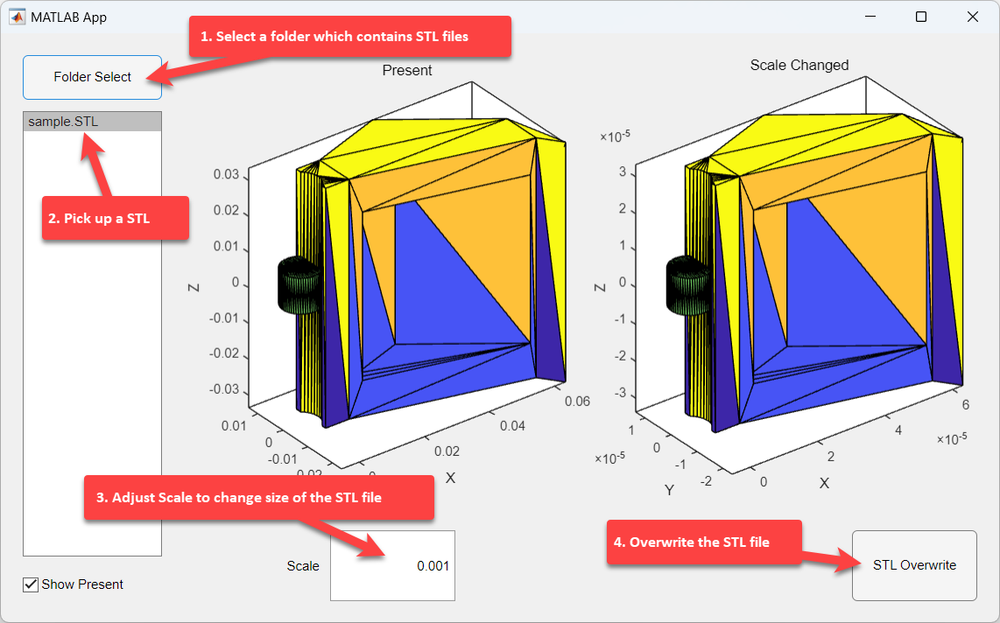

# STL Scale Changer 

The STL Scale Changer streamlines the process of directly changing the scale of STL files within a specified folder. For instance, it facilitates easy unit conversion from millimeters to meters. 

By enabling users to select a folder, choose an STL file, and adjust its scale, this tool allows for the proper sizing of STL files in simulation environments such as Robotics System Toolbox&trade; of MATLAB&reg;. The functionality to overwrite the original STL file ensures the integrity of the project is maintained without the need for manual adjustments.

## Setup 
To set up STL Scale Changer, you have two options:
1. Run the `StlScaleChanger.mlapp` directly in MATLAB.
2. Install the `STL Scale Changer.mlappinstall` file.

### MathWorks Products (https://www.mathworks.com)
Requires MATLAB&reg; release R2024a or newer
- [MATLAB&reg;](https://www.mathworks.com/products/matlab.html)

### 3rd Party Products:
No third-party products required.

## Getting Started
You can get started easily with the following four steps:
1. Select a folder which contains STL files (ex. ./example)
2. Pick up a STL
3. Adjust Scale to change size of the STL file
4. Overwrite the STL file
   

## License
The license is available in the License.txt file in this GitHub repository.

## Community Support
For questions and support, please visit [MATLAB Central](https://www.mathworks.com/matlabcentral)

Copyright 2024 The MathWorks, Inc.
